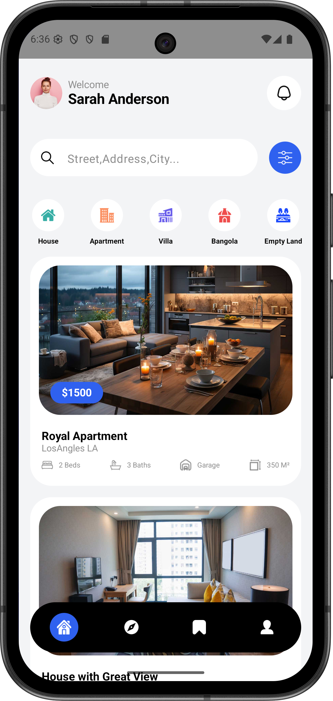
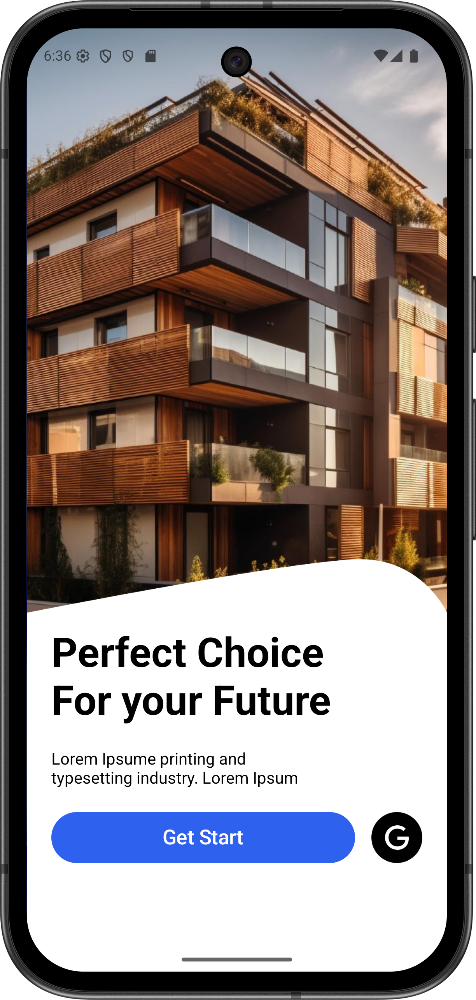

# RealState - Android UI Practice Project

This project is a **real estate app prototype** built to practice **UI/UX design** and **Kotlin with Jetpack Compose**.

## Project Goal

The main objective is to improve:

- visual design skills for mobile interfaces
- Compose-based screen building and layout composition
- navigation flow between app screens

## Tech Stack

- Kotlin
- Jetpack Compose (Material 3)
- Android Navigation (Compose)
- Gradle (Kotlin DSL)

## Current Scope

- UI-focused real estate experience
- multiple screens connected with Compose Navigation
- local assets (images/icons) for mock listings and interface elements

## Screenshots

### HomeScreen



### SplashScreen



## Project Structure

```text
realState/
  app/
	src/main/
	  java/com/jesse/realstate/
	  res/
  gradle/
  build.gradle.kts
  settings.gradle.kts
```

## Notes

- This is a study/practice project focused on design and Compose.
- It is intended as a UI prototype, not a production-ready real estate platform.

